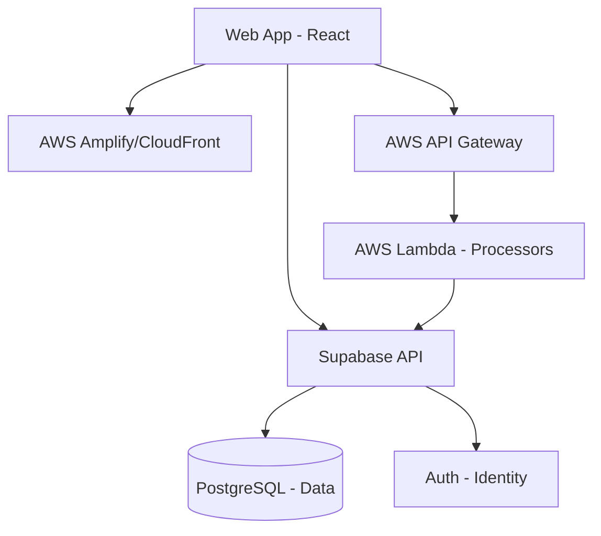

# Cloud Architecture Overview

The **Coffee Purchase Management System** is designed to be hosted on **Amazon Web Services (AWS)** using a hybrid-cloud approach that combines managed backend services with custom cloud infrastructure.

## Cloud System Structure

### 1. Frontend (Web Application)
- **AWS Amplify / S3 + CloudFront**: The React/Vite application is deployed as a static site.
- **Global Delivery**: Route 53 handles the DNS, while CloudFront provides low-latency access globally.

### 2. Backend Services (Compute)
- **AWS Lambda**: Serverless functions for lightweight, event-driven tasks (e.g., sending email notifications, processing image uploads for EUDR).
- **AWS API Gateway**: The primary entry point for custom API requests, providing rate limiting and authentication verification.
- **Supabase Core**: Currently, Supabase is used as the primary backend-as-a-service (BaaS), managing:
    - **PostgreSQL Database**: Storing all purchase, user, and financial data.
    - **GoTrue Auth**: Handling user registration, login, and JWT management.
    - **Storage**: Managing receipts and profile documents.

### 3. Integration Diagram

## Cloud Tools & Purpose
-   **IAM (Identity & Access Management)**: Granular permissions for AWS services.
-   **AWS X-Ray**: Tracing requests across the distributed system to identify bottlenecks.
-   **AWS CloudWatch**: Logging and monitoring for system health and performance alerts.
-   **Route 53**: DNS management for custom domains.

## Scaling Strategy
The architecture is transition-ready for **100X Scale** by:
1.  **Database Migration**: Moving from managed Supabase to **AWS RDS (Aurora)** if horizontal scaling becomes a bottleneck.
2.  **Containerization**: Deploying the core business logic as **Docker** containers on **AWS ECS (Fargate)** if cold starts in Lambda impact the user experience.
3.  **Local Caching**: Leveraging **Redis (AWS ElastiCache)** for frequently accessed pricing data and report fragments.

---
[README.md](file:///f:/JANUARY%202026/Coffee%20Management%20System/DOCS/README.md) | [SCALABILITY.md](file:///f:/JANUARY%202026/Coffee%20Management%20System/DOCS/SCALABILITY.md)
