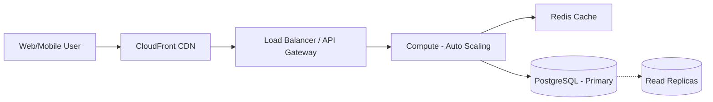

# Performance & Scalability Strategy

To ensure the **Coffee Purchase Management System** can handle **100X** the current load (e.g., millions of purchases and transactions), we must focus on both **Correctness** and **Measured Performance**.

## Verifying Correctness

Correctness is non-negotiable for a financial management system. We use a multi-tiered approach:
1. **Database Integrity**:
    - **Foreign Key Constraints**: Ensuring that every purchase and settlement is linked to a valid entity (Farmer/Agent).
    - **Atomic Transactions**: Using SQL `BEGIN/COMMIT` for complex operations (e.g., record_agent_settlement_v1) to prevent partial data entry.
2. **Automated Testing**:
    - **Unit Tests**: Verifying individual utility functions (e.g., price calculation in `pricesService.ts`).
    - **Integration Tests**: Running automated scripts against a Supabase test environment to verify end-to-end flows.
3. **Audit Logging**:
    - Every financial transaction is recorded with a unique, immutable ID and a "Pending" or "Confirmed" status to prevent double-spending or lost records.

## Measuring 100X Scale Performance

A system that works for 1,000 farmers may fail for 100,000. We will measure and scale using the following techniques:

### 1. Load Testing (Benchmarking)
- **Tools**: **AWS X-Ray** and **K6/JMeter**.
- **Metrics**: 
    - **Latency**: Target < 200ms for core purchase entries.
    - **Throughput**: Support > 500 requests per second (RPS) for the dashboard.
    - **Error Rate**: Target < 0.1% under peak load.

### 2. Database Optimization
- **Indexing Strategy**: Implementing indices on high-query columns (e.g., `farmer_id`, `created_at`).
- **Read Replicas**: If read traffic (reporting) exceeds capacity, we will introduce **AWS RDS (Aurora)** Read Replicas to offload the primary database.
- **Query Optimization**: Using **Supabase Explain Analyze** to identify slow-running SQL queries.

### 3. Horizontal Scaling
- **Serverless Scaling**: AWS Lambda and API Gateway scale automatically with the number of incoming requests.
- **Concurrent Requests**: Monitoring "Concurrent Executions" in Lambda to ensure the system doesn't hit regional limits.

### 4. Caching & CDNs
- **AWS ElastiCache (Redis)**: Caching frequently accessed data like daily coffee prices.
- **CloudFront Edge Caching**: Reducing latency for static assets (React components, images) globally.

## Scaling Architecture

---
[README.md](file:///f:/JANUARY%202026/Coffee%20Management%20System/DOCS/README.md) | [CLOUD_ARCHITECTURE.md](file:///f:/JANUARY%202026/Coffee%20Management%20System/DOCS/CLOUD_ARCHITECTURE.md)
